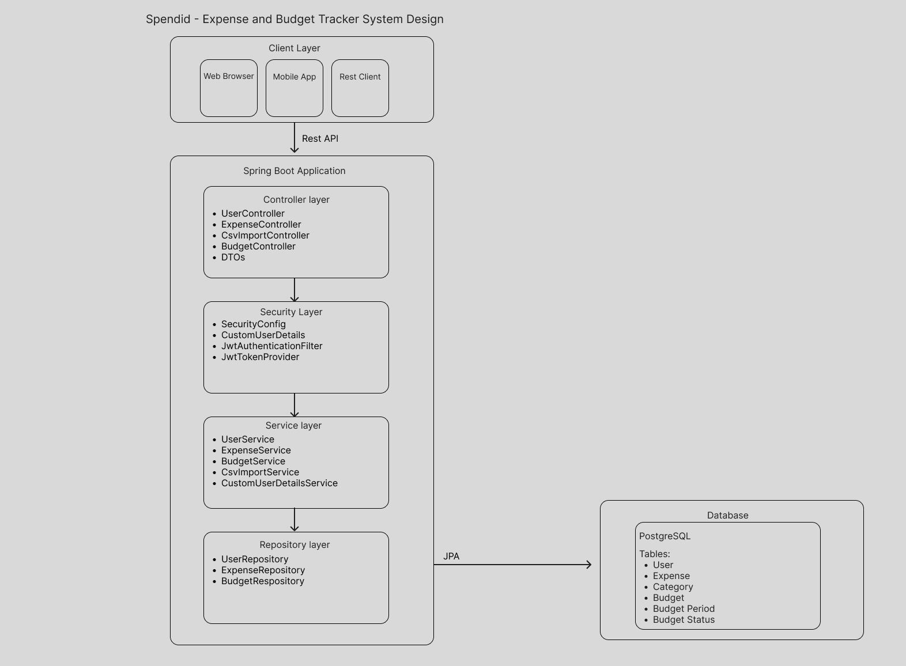
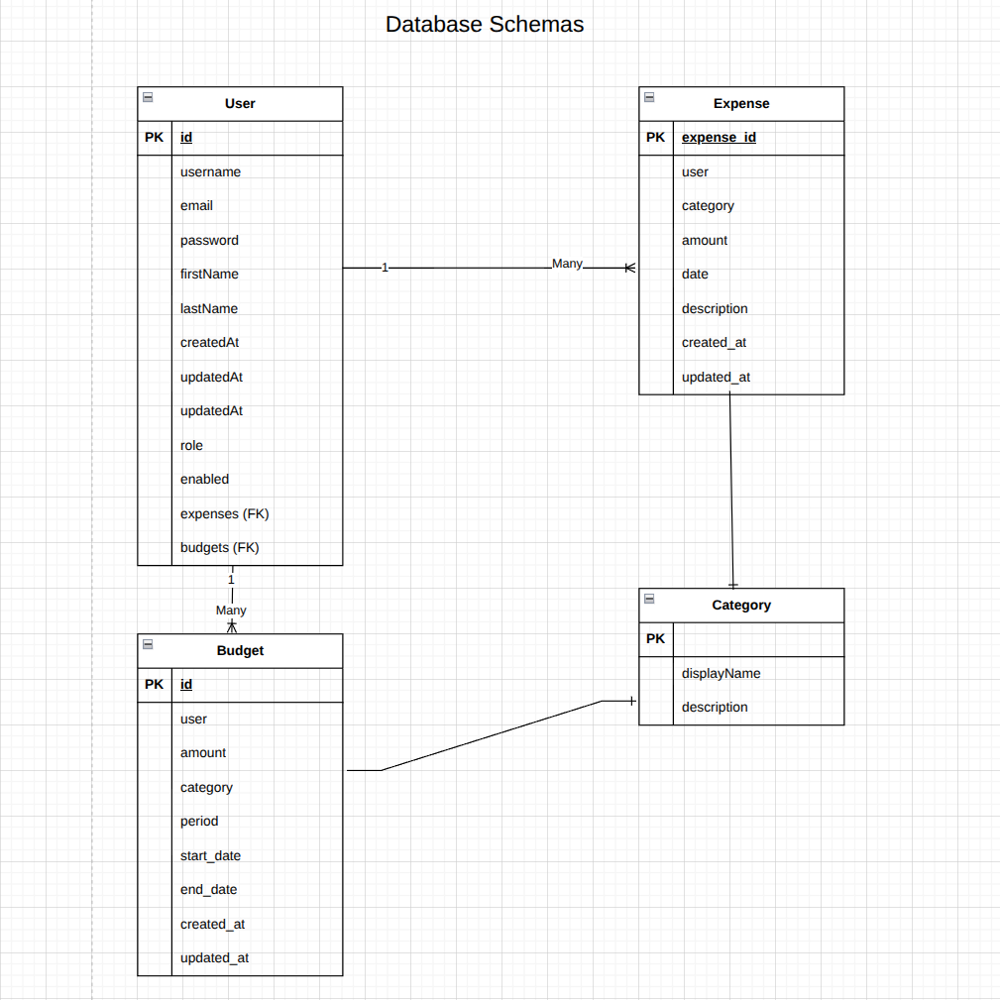

# Spendid 💰
An expense and budget tracking application that makes managing your finances splendid.

## Overview
Spendid is a modern expense tracking app that leverages Spring Boot to automatically categorize expenses, extract data from csv files, and provide budget tracking. Built with a focus on automation and user experience, Spendid eliminates the tedious manual entry traditionally associated with expense and budget tracking.

**This project is an iteration of Credit Flux, repurposed and enhanced with a fully implemented expense tracking API, migrated to PostgreSQL, and expanded with financial management features.**

## Architecture

### Technical Architecture

*Overview of the system architecture showing backend, frontend, database, and AI integration layers*

### Entity Relationship Diagram

*Database schema showing relationships between users, expenses, categories, and budgets*

### User Flow Diagram

*Primary user journeys through expense entry, categorization, and analysis*

## Features

### Core Functionality
- **Manual Expense Entry** - Quick and intuitive expense logging
- **CSV Import** - Upload CSV, PDF, or Excel bank statements for automatic processing
- **Budget Tracking** - Set and monitor budgets by category

## Tech Stack

### Backend
- **Framework**: Spring Boot
- **Database**: PostgreSQL (migrated from MySQL)
- **Authentication**: JWT
- **Security**: Role-based access control

### File Processing
- CSV parsing with Papaparse
- PDF extraction for bank statements
- Excel file support (XLSX)

### Prerequisites
- Java 17+
- PostgreSQL 14+

## License
MIT

